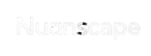

<!-- Animated Logo Nuanscape SVG -->

  

<!-- Typing SVG Headline -->

  <a href="https://www.nuanscape.tech"><b>🌐 Website Resmi</b></a> •
  <a href="#-unduh-dokumen-company-profile-resmi"><b>📄 Unduh Profile PDF</b></a> •
  <a href="#-informasi-kontak--diskusi"><b>💬 Hubungi Kami</b></a>

---

## 🚀 Tentang Nuanscape

**Nuanscape** adalah agensi pengembang perangkat lunak dan mitra teknologi (*software agency & technology partner*) berbasis di **Aceh, Indonesia** (didirikan 2026). Kami membantu bisnis, startup, dan organisasi merancang serta membangun produk digital yang resilien, aman, mudah dikembangkan, dan siap pakai.

Kami tidak sekadar menulis kode. Kami berfokus pada akar kebutuhan operasional Anda melalui rekayasa perangkat lunak (*software engineering*) yang terstruktur, transparan, dan terukur.

### 💡 Tiga Pilar Utama Kami
- 👨💻 **Human-Led**: Keputusan arsitektur teknis, logika bisnis, standar keamanan, dan kendali kualitas berada 100% di tangan *engineer* berpengalaman.
- 🤖 **AI-Assisted**: Menggunakan AI sebagai alat bantu internal (*engineering accelerator*) untuk efisiensi riset, pembuatan draf kode, dan pengujian.
- ⚡ **Technology-Driven**: Membangun sistem berskala industri menggunakan teknologi modern, aman, dan dapat diandalkan.

---

## 🛠️ Matriks Teknologi & Kapabilitas Teknis

| Kategori | Teknologi & Tools Utama |
| :--- | :--- |
| **Frontend & UI/UX** |       |
| **Backend & Arch** |       |
| **Basis Data & Cloud** |      |
| **Integrasi AI** |     |

---

## 💼 Kategori Solusi Digital yang Kami Bangun

- 🏢 **SaaS & Product Platforms**: Aplikasi multi-tenant, billing subscription, RBAC, dan portal admin.
- 📊 **Internal Tools & Dashboards**: Monitoring operasional, custom CMS, approval workflow, dan inventaris.
- 📱 **Mobile-First Applications**: Aplikasi layanan pelanggan, self-service portal, dan aplikasi tim lapangan.
- 🔗 **API & System Integration**: Menghubungkan ERP, CRM, payment gateway, dan API pihak ketiga.
- 🤖 **AI-Enhanced Features**: Pencarian dokumen cerdas RAG, asisten AI interaktif, dan otomasi data.
- 🚀 **MVP & Rapid Prototypes**: Produk versi awal fungsional yang siap diuji ke pasar atau investor.

---

## 👥 Tim Kunci & Struktur Peran

- 🎨 **Lead Frontend & Creative Design — Muharriel**  
  *Kontak*: `0852-7085-9214` | Menangani UI/UX Figma, Design System, serta integrasi frontend web & mobile.
- ⚙️ **Lead Backend & System Architecture — Ferta Junindi**  
  *Kontak*: `0853-6280-2143` | Merancang arsitektur sistem, basis data, REST/GraphQL API, serta performa & keamanan backend.
- 📈 **Digital Marketing & Project Manager (PM) — Muhammad Dzikri**  
  Menangani alokasi sprint, koordinasi komunikasi berkala dengan klien, dan strategi pemasaran digital.

---

## 🛡️ Jaminan Standar Layanan

- ⏱️ **Target Respons SLA < 2 Jam Kerja**: Dukungan komunikasi cepat via Email, WhatsApp, atau Slack.
- 🛡️ **Garansi 1 Bulan Pascapeluncuran**: Layanan perbaikan kendala (*bug fixing*) tanpa biaya tambahan.
- 🔒 **100% Kepemilikan HKI Kode Sumber**: Kode sumber, desain, dan aset beralih penuh kepada klien setelah penyelesaian proyek.

---

## 📄 Unduh Dokumen Company Profile Resmi

Dokumen resmi **Company Profile Nuanscape 2026** tersedia untuk diunduh secara publik:

| Format File | Tautan Unduh Langsung | Deskripsi |
| :--- | :--- | :--- |
| **PDF (High-Res)** | 📄 [**Unduh Nuanscape_Company_Profile.pdf**](output/Nuanscape_Company_Profile.pdf) | Dokumen PDF 21 halaman utuh dengan sampul Canva & diagram SOP 300 DPI |

---

## 📊 Statistik Repositori GitHub

 

---

## 📞 Informasi Kontak & Diskusi

| Parameter | Rincian Kontak |
| :--- | :--- |
| **Nama Perusahaan** | **Nuanscape** |
| **Domisili / Alamat** | Aceh, Indonesia 🇮🇩 |
| **Email Resmi** | `nuanscape@gmail.com` |
| **Website Resmi** | [www.nuanscape.tech](https://www.nuanscape.tech) |
| **Instagram** | [@nuanscape](https://instagram.com/nuanscape) |
| **Kontak WhatsApp** | Ferta Junindi (`+62 853-6280-2143`) / Muharriel (`+62 852-7085-9214`) |
| **Jam Operasional** | Senin – Jumat, 08.00 – 17.30 WIB |

 

> *"Mari ubah kebutuhan dan tantangan bisnis Anda menjadi solusi teknologi yang praktis dan andal."*

**Nuanscape** — *Escape the norm, Enter the Nuanscape.*  
*Human-Led. AI-Assisted. Technology-Driven.*

<!-- Capsule Render Footer Wave -->

